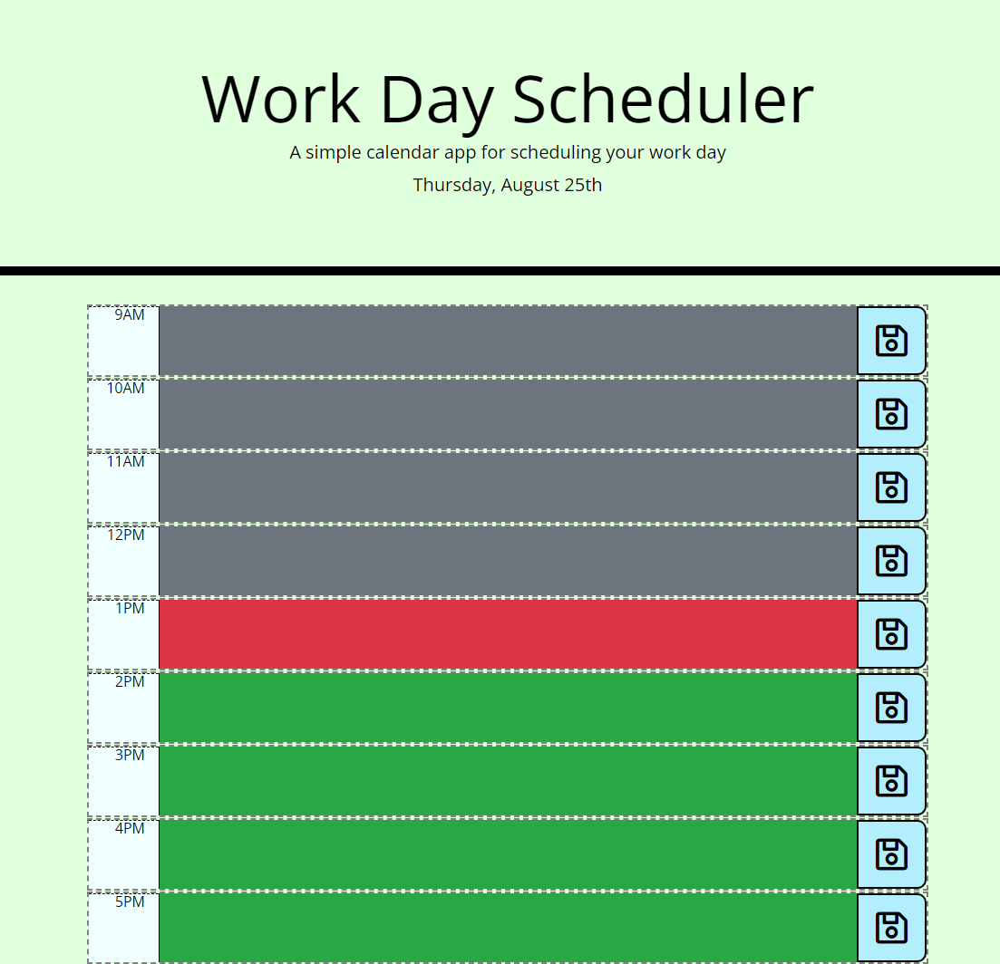

# Work-Day-Scheduler
## Table of Contents

* [Description](#description)
* [Visuals](#visuals)
* [Link](#link-to-site)

## Description
05-APIs

I created a work day scheduler using different APIs such as moment, jquery, and bootstrap. The scheduler allows the user to store ToDo tasks that will be saved for the next time they log in. The scheduler also provides the user with the current day and month. As well as changes the color of the background based on the time to let the user know what tasks need to be completed during their current hour. 

## Visuals

## Link to Site
[Link to live site](https://supernaldeity.github.io/Work-Day-Scheduler/)